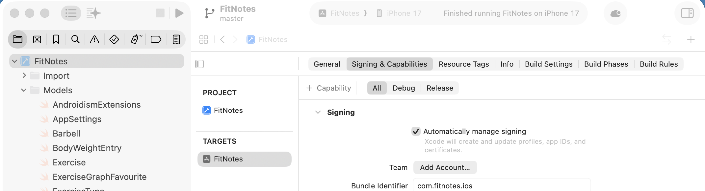

# FitNotes iOS
Hi all, I was tired of having to pay premium for something that was available on Android for free. This is vibe-coded so it will not be maintained much. From here on out is all words by Claude AI not my words. Enjoy! - StarWhiz


A native iOS workout tracker built as an unofficial port of the popular Android app [FitNotes](https://play.google.com/store/apps/details?id=com.github.jamesgill.fitnotes) by James Gill. Built with SwiftUI and SwiftData for iOS 17+.

> **Vibe coded with [Claude Code](https://claude.ai/code).** The entire app — models, import pipeline, views, services, and platform integrations — was built through an AI-assisted session using the real Android `.fitnotes` SQLite backup as the source of truth for data structure. No guessing at schema; every field, enum value, colour encoding, and Android-ism was reverse-engineered directly from a live backup file.

---

## Why This Exists

FitNotes on Android is excellent. It has no official iOS app, there are paid ones like Fitnotes 2 that are very good clones without bugs, but they are freemium and require paying $$$ after using them for a while. This one has a problem where you can't import notes from the .fitnotes Android backup format. If you just want to run this skip to https://github.com/StarWhiz/vibecoded-fitnotes-ios-port#building-an-ipa-for-altstore-no-paid-account-required skip step 1 and step 2, download the release, and install the .ipa file with altstore.

---

## Features

### Core Workout Tracking
- Log sets with weight, reps, distance, or duration depending on exercise type
- Exercises grouped by category with colour coding (matching Android)
- Auto-fills last session's weight and reps when you revisit an exercise
- Personal record detection with trophy indicators
- Workout comments and per-set notes

### Import from Android
- One-time import of your `.fitnotes` SQLite backup file
- Preserves all exercises, categories, sets, routines, goals, and body measurements
- Import verification view with side-by-side source vs. target counts
- Handles Android-specific data quirks (signed ARGB colours, metric × 1000 storage, etc.)

### Rest Timer
- Configurable rest timer with per-exercise overrides
- Live Activity on Dynamic Island and Lock Screen
- Local notification when timer expires (works in background)
- Add time without restarting

### iOS-Native Extras
- **HealthKit integration** — syncs workouts, body weight, and body fat
- **Siri Shortcuts** — start workout, log a set, check rest timer, query 1RM
- **Focus Filter** — automatically activates "Gym Focus" during active workouts
- **Widgets** — today's workout, last workout, streak counter, next routine
- **Share as image** — social-media-ready workout card with category colours and PR badges
- **Haptic feedback** throughout the workout flow
- **Plate calculator** and **1RM calculator** built in

### Body Tracker
- Body weight and body fat logging
- Custom measurements (neck, waist, chest, etc.)
- HealthKit sync for body composition data

---

## Tech Stack

| Concern | Choice |
|---|---|
| Platform | iOS 17+ |
| UI | SwiftUI |
| Persistence | SwiftData |
| State | Swift Observation (`@Observable`) |
| Concurrency | `async/await` |
| SQLite import | [GRDB.swift](https://github.com/groue/GRDB.swift) |
| Live Activities | ActivityKit |
| Health | HealthKit |
| Shortcuts | App Intents |

---

## Getting Started

### Requirements
- A Mac running macOS 13 (Ventura) or later
- [Xcode 15+](https://apps.apple.com/app/xcode/id497799835) — free on the Mac App Store
- An Apple ID (free — no paid developer account required to install on your own iPhone)
- iPhone running iOS 17 or later
- A `.fitnotes` backup file from the Android app (optional — you can start fresh)

---

## Building & Installing on Your iPhone

### Step 1 — Clone the repo

```bash
git clone https://github.com/StarWhiz/vibecoded-fitnotes-ios-port.git
cd vibecoded-fitnotes-ios-port
```

### Step 2 — Open in Xcode

```bash
open FitNotes.xcodeproj
```

Wait for Xcode to resolve the Swift Package dependencies (GRDB.swift). This happens automatically and takes ~30 seconds on first open.

### Step 3 — Set your Team (signing)

1. In Xcode, click the **FitNotes** project in the left sidebar
2. Select the **FitNotes** target under TARGETS
3. Go to the **Signing & Capabilities** tab
4. Under **Team**, select your Apple ID from the dropdown
   - If your Apple ID isn't listed: **Xcode → Settings → Accounts → + → Apple ID**
5. Change the **Bundle Identifier** to something unique, e.g. `com.YOURNAME.fitnotes`
   - This is required because free Apple IDs can't reuse bundle IDs from other developers



### Step 4 — Connect your iPhone

1. Plug your iPhone into your Mac with a USB cable
2. On your iPhone, tap **Trust** when prompted
3. In Xcode, select your iPhone from the device dropdown at the top (next to the play button)

### Step 5 — Build and install

Press **⌘R** or click the ▶ Play button. Xcode will build the app and install it directly to your iPhone.

**First launch may fail** with "Untrusted Developer" — fix it on your iPhone:
> **Settings → General → VPN & Device Management → [Your Apple ID] → Trust**

Then open the app normally.

> The app seeds 8 built-in exercise categories on first launch. No setup required to start logging workouts immediately.

---

### Free Apple ID vs Paid Developer Account

| | Free Apple ID | Paid ($99/yr) |
|---|---|---|
| Install on your own iPhone | ✅ | ✅ |
| Certificate expires | Every **7 days** | Every 1 year |
| Max devices | 3 apps at a time | Unlimited |
| Distribute to others | ❌ | ✅ (TestFlight / App Store) |
| Works for personal use | ✅ | ✅ |

With a free Apple ID you'll need to reconnect your iPhone to Xcode and rebuild every 7 days to keep the app installed. This is Apple's limitation, not this app's.

---

### Keeping It Installed (Free Account Workaround)

To avoid rebuilding every 7 days without a paid account:

- **[AltStore](https://altstore.io)** — sideloading tool that auto-refreshes apps in the background using your Apple ID. Install AltStore on your iPhone, then use it to sideload the `.ipa` from Xcode.
- **Paid Apple Developer account** ($99/year) — signs the app for a full year. Worth it if you plan to tinker with multiple apps.

---

### Building an IPA for AltStore (No Paid Account Required)
> [!NOTE]  
> If you don't want to build it yourself you can just visit the releases page and get the .ipa file there https://github.com/StarWhiz/vibecoded-fitnotes-ios-port/releases/tag/Main

Xcode's built-in export options all require a paid Apple Developer account. You can work around this by manually extracting the app binary from an archive. This `.ipa` can then be sideloaded with AltStore.

#### Step 1 — Archive the app

In Xcode (with your iPhone **not** connected, or with **Any iOS Device (arm64)** selected as the destination):

> **Product → Archive**

Xcode will build a release archive. When it finishes, the **Organizer** window opens automatically.

#### Step 2 — Locate the archive in Finder

In the Organizer, right-click your archive and choose **Show in Finder**, or navigate directly to:

```
~/Library/Developer/Xcode/Archives/
```

The archive is a folder named something like `FitNotes 2026-04-19 12.00.00.xcarchive`.

#### Step 3 — Open the package contents

Right-click the `.xcarchive` file → **Show Package Contents**

Navigate into:

```
Products → Applications
```

You will see `FitNotes.app` inside that folder.

#### Step 4 — Extract and repackage as an IPA

1. **Drag `FitNotes.app` to your Desktop** (or any working folder)
2. Create a new folder named exactly **`Payload`** (capital P, no spaces)
3. Move `FitNotes.app` **inside** the `Payload` folder
4. Right-click the `Payload` folder → **Compress "Payload"** — this creates `Payload.zip`
5. Rename `Payload.zip` → **`FitNotes.ipa`**

> An `.ipa` is just a zip file containing a `Payload/` folder with the `.app` inside. Renaming is all that's needed.

#### Step 5 — Sideload with AltStore

1. Install [AltStore](https://altstore.io) on your iPhone and Mac (follow their setup guide)
2. Open AltStore on your iPhone
3. Tap the **+** button → select your `FitNotes.ipa`
4. AltStore signs and installs it using your Apple ID

AltStore can auto-refresh the app in the background (requires AltStore to be running on your Mac on the same Wi-Fi), keeping the 7-day certificate renewed without reconnecting to Xcode.

---

### Importing Your Android Data

> ⚠️ **Import is currently broken.** The import flow gets stuck in a loop and does not complete successfully. This is a known issue caused by the vibe-coded nature of the project and won't be fixed anytime soon. If preserving your Android history is the main reason you're here, hold off until this is resolved.

The import flow *exists* in the app (Settings → Import from Android) but should be considered non-functional at this time.

---

## Project Structure

```
FitNotes/
├── Models/          # SwiftData @Model classes (21 models)
├── Stores/          # @Observable state stores
├── Services/        # Business logic, HealthKit, calculators
├── Views/           # SwiftUI views (25+ screens)
├── Import/          # SQLiteImporter — reads .fitnotes backup via GRDB
├── Intents/         # App Intents for Siri and Shortcuts
├── LiveActivity/    # Rest timer ActivityKit attributes
├── Widget/          # Home screen and Lock Screen widgets
└── ai-context/      # Project documentation and architecture notes
```

---

## How It Was Built

This app was **vibe coded with Claude Code** — Anthropic's AI coding assistant. The workflow:

1. The real Android `FitNotes_Backup.fitnotes` SQLite file was used as the primary reference. Every table, column, enum value, and quirk was documented in `ai-context/database_discovery.md` before writing a single line of Swift.
2. Architecture and feature scope were planned in `ai-context/technical_architecture.md` and `ai-context/product_roadmap.md`.
3. Claude Code generated all 97 source files across 5 phases — models, import pipeline, state management, services, views, and platform integrations.
4. Compilation errors, SwiftData macro quirks, and runtime issues were debugged iteratively with Claude Code.

The `ai-context/` directory contains all the planning documents and phase summaries if you want to understand the decisions made along the way.

---

## Known Limitations

- **Widget extension target** — widget source files are in `Widget/` but the Xcode widget extension target hasn't been configured yet. Widgets won't appear until that's set up.
- **iCloud sync** — `CloudSyncManager.swift` is stubbed; CloudKit sync is not yet implemented.
- This is an **unofficial port** — not affiliated with James Gill or the original FitNotes app.

---

## Contributing

PRs welcome. The codebase follows standard SwiftUI/SwiftData conventions. A few things worth knowing before editing models:

- **Never add `@Relationship` to both sides of a bidirectional relationship** — SwiftData's macro expander will loop. Only the parent/has-many side declares `@Relationship(inverse:)`. See `ai-context/build_fixes.md` for the full explanation.
- All weights are stored internally in **kg** regardless of display units. Convert at the view layer using `settingsStore.display(kg:)`.
- Android ARGB colour ints use signed `Int32` — use `UInt32(bitPattern:)` when extracting RGB components.

---

## License

MIT License

Copyright (c) 2026 Tai Dao

Permission is hereby granted, free of charge, to any person obtaining a copy
of this software and associated documentation files (the "Software"), to deal
in the Software without restriction, including without limitation the rights
to use, copy, modify, merge, publish, distribute, sublicense, and/or sell
copies of the Software, and to permit persons to whom the Software is
furnished to do so, subject to the following conditions:

The above copyright notice and this permission notice shall be included in all
copies or substantial portions of the Software.

THE SOFTWARE IS PROVIDED "AS IS", WITHOUT WARRANTY OF ANY KIND, EXPRESS OR
IMPLIED, INCLUDING BUT NOT LIMITED TO THE WARRANTIES OF MERCHANTABILITY,
FITNESS FOR A PARTICULAR PURPOSE AND NONINFRINGEMENT. IN NO EVENT SHALL THE
AUTHORS OR COPYRIGHT HOLDERS BE LIABLE FOR ANY CLAIM, DAMAGES OR OTHER
LIABILITY, WHETHER IN AN ACTION OF CONTRACT, TORT OR OTHERWISE, ARISING FROM,
OUT OF OR IN CONNECTION WITH THE SOFTWARE OR THE USE OR OTHER DEALINGS IN THE
SOFTWARE.

---

*Not affiliated with James Gill or the FitNotes Android app. Built out of respect for a great app that deserves an iOS counterpart.*
